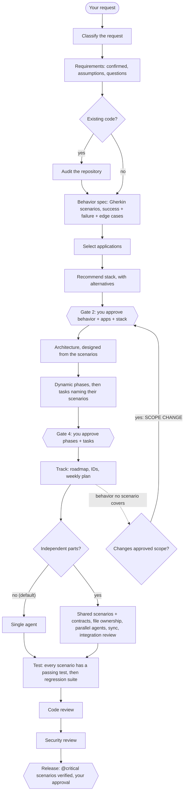

# AgentFlow — AI Engineering System

[](https://github.com/ahtishamshahzad/agent_dev_flow/actions/workflows/validate.yml) [](LICENSE)

**An operating system for AI-assisted software engineering.** It makes a coding agent work like a disciplined engineering team: classify the request, understand it, plan it, get your approval, then build, test, review, secure, release — and track it week by week. It is not a prompt collection: it is rules, gates, a library of focused skills, and a project record your agent reads and writes inside your repo.

```bash
npx github:ahtishamshahzad/agent_dev_flow init      # adds .ai/ + your editor's adapter to a project
```

Then, in your agent: *"Use the project-orchestrator skill. This is a new project: <what you want>. Do not implement code."* It stops twice for your approval before writing any code.

> Version **1.7.0** · MIT · Node 18+ for the installer · Full guide: [`.ai/README.md`](.ai/README.md)

**Names:** *AgentFlow* is the product and the `agentflow` installer. The *AI Engineering System* is what it installs — the canonical `.ai/` directory. `agent_dev_flow` is this repository.

### How a request flows



### Behavior-driven development

AgentFlow uses **Gherkin as the behavioral contract** across the whole lifecycle — not as a test format bolted on at the end:

```
Requirement → Gherkin scenarios (approved) → Architecture → Tasks → Implementation → Tests → Regression → Release
```

- **Before any behavior change**, the agent finds the existing scenarios, updates or writes them — success, failure, and the edge cases that matter — and you approve them before anything is designed.
- **Architecture is designed from them**: an offline scenario forces local storage, sync, and idempotency into the design.
- **Every scenario maps to a test that passes.** Gherkin says what the system must do; tests are the evidence. Writing a scenario proves nothing on its own.
- **Every bug leaves a regression scenario** that failed before the fix and stays forever.
- **Behavior no scenario covers is a scope question**, not a coding decision; parallel agents all build against the same approved scenarios.
- **`@critical` scenarios block the release** until verified.
- Not for renames, formatting, or refactors proven to change nothing.

`npx github:ahtishamshahzad/agent_dev_flow gherkin validate` lints a project's `features/` against the contract; `gherkin trace --tests <dir>` lists scenarios no test names and fails on an untested `@critical` one. Policy: [`.ai/system/GHERKIN_RULES.md`](.ai/system/GHERKIN_RULES.md) · Examples: [`examples/gherkin/`](examples/gherkin/README.md).

### Technology in context — not "always the latest"

| | New project | Existing project |
|---|---|---|
| Rule | Latest **stable**, appropriate technology — no alpha, beta, or release candidates; current LTS for runtimes | **Keep what works.** A newer version existing is not a reason to upgrade |
| Versions come from | The registry and official release pages, checked at decision time — **not the model's memory**; anything unverifiable is labelled | The lock files, recorded in the audit |
| Documentation | Official docs for the selected version | Official docs for the **installed** version |
| Change when | — | A vulnerability (escalated at once), end of life, a required feature, a compatibility requirement, a deprecation — recorded with its trigger, migration plan, and regression scenarios |

Bug fixes and refactors keep the technology unless it is the cause or the goal.

```bash
npx github:ahtishamshahzad/agent_dev_flow drift            # installed vs latest stable, advisories, Node EOL
```

```
package        installed  latest stable  available  recommended
bcrypt         5.1.1      6.0.0          yes        no — newer alone is not a reason
express        4.19.2     5.2.1          yes        YES — security (low)
    smallest safe version: 4.20.0 (same major — no major upgrade needed)
jsonwebtoken   8.5.1      9.0.3          yes        YES — security (high)
    smallest safe version: 9.0.0 (needs a major upgrade — plan a migration)
node 16 (.nvmrc)                                    YES — end of life (2023-09-11)
```

`--fail-on security|eol|any` makes it a CI gate. Rules: [`.ai/system/TECHNOLOGY_GOVERNANCE_RULES.md`](.ai/system/TECHNOLOGY_GOVERNANCE_RULES.md) · Examples: [`examples/technology-governance/`](examples/technology-governance/README.md).

### Works with

| Agent | How it reads the system | Native integration |
|---|---|---|
| **Claude Code** | `CLAUDE.md` → `.ai/` | Yes — optional plugins make every skill a `/ai-core:…` command |
| **OpenAI Codex** | `AGENTS.md` → `.ai/` | Reads `AGENTS.md` natively; no plugin |
| **Cursor** | `.cursor/rules/project.mdc` → `.ai/` | Rules file only |
| **Windsurf** | `.windsurf/rules/project.md` → `.ai/` | Rules file only |
| **GitHub Copilot** | `.github/copilot-instructions.md` → `.ai/` | Instructions file only |
| **Antigravity, any file-reading agent** | `AGENTS.md` → `.ai/` | Generic — point the agent at `AGENTS.md` |

Every adapter is a thin pointer; the rules exist once, in `.ai/`.

### Context cost

Skills load one at a time, only when needed. What stays in context every turn is the list of installed skill descriptions: about 2k tokens per pack (≈12k for all eight) — install the packs a project needs, not all of them. A session's start-up reads (`AGENTS.md`, operating rules, workflow, project status) are a few thousand tokens; the full `.ai/README.md` map is opened only when needed.

---

## What's inside

| Layer | Count | Where |
|-------|-------|-------|
| **Skills** (reusable capability modules) | **180** | [`.ai/skills/`](.ai/skills/README.md) |
| **Agents** (roles for multi-agent runs) | 13 | [`.ai/agents/`](.ai/agents/README.md) |
| **Hooks** (tool-neutral lifecycle checklists) | 13 | [`.ai/hooks/`](.ai/hooks/README.md) |
| **Workflows** (per request type) | 12 | [`.ai/workflows/`](.ai/workflows/README.md) |
| **Templates** (fill-in documents) | 32 | [`.ai/templates/`](.ai/templates/README.md) |
| **Prompts** (tool-neutral starters) | 19 | [`.ai/prompts/`](.ai/prompts/README.md) |
| **Checklists** (verifiable gate/hook checks) | 18 | [`.ai/checklists/`](.ai/checklists/README.md) |

Skills are organized into **8 packs**: core (29), mobile (36), web & dashboard (26), backend (31), database (15), testing (15), devops (16), security (12). Plus system rules, knowledge, memory, and references — all in [`.ai/`](.ai/README.md).

**Find a skill by what you want to do:** [`.ai/skills/SKILLS_INDEX.md`](.ai/skills/SKILLS_INDEX.md) — "I want to add login", "…design the database", "…set up CI".

## Install

### Fastest — one command (all editors)

Set up any project with a single command. It copies `.ai/`, the `AGENTS.md` entry point, and your editor adapter(s) — no dependencies, no stack, no repo:

```bash
npx github:ahtishamshahzad/agent_dev_flow init
```

Only the editors you use: `--editor claude,cursor` (values: `claude`, `cursor`, `windsurf`, `copilot`, `codex`, `all`; default `all`). Also `--force`, `--dry-run`, `--help`. This installs the **files**; Claude Code's native skill plugins are the separate step below.

### Claude Code — native plugins

The skills are packaged as installable Claude Code plugins (one per pack):

```
/plugin marketplace add ahtishamshahzad/agent_dev_flow
/plugin install ai-core@agent_dev_flow
```

Add whichever packs a project needs — `ai-mobile`, `ai-web`, `ai-backend`, `ai-database`, `ai-testing`, `ai-devops`, `ai-security`. `ai-core` is the recommended baseline (it has `project-orchestrator`, which drives the whole pipeline). Invoke by namespace: `/ai-core:project-orchestrator`, `/ai-backend:backend-authorization`. See [`plugins/README.md`](plugins/README.md).

### Codex, Cursor, Windsurf, Copilot, Antigravity — copy the files

These read the system through their adapters. The `npx … init` command above sets them all up automatically; to copy manually instead, copy `.ai/` plus the entry point and your editor's adapter into a project:

```bash
cp -r .ai AGENTS.md CLAUDE.md /path/to/your-project/
```

| Editor | Adapter it reads |
|--------|------------------|
| Claude Code | `CLAUDE.md` |
| OpenAI Codex / general agents | `AGENTS.md` |
| Cursor | `.cursor/rules/project.mdc` |
| Windsurf | `.windsurf/rules/project.md` |
| GitHub Copilot | `.github/copilot-instructions.md` |
| Antigravity | `AGENTS.md` |

Full options (copy-in vs. submodule/subtree, per-editor matrix): [`INSTALLATION.md`](INSTALLATION.md).

## Use it

Full walkthrough — per editor, new project and existing project: **[`USAGE.md`](USAGE.md)**. Prompt-only version: [`QUICK_START.md`](QUICK_START.md).

Same prompts in every editor; only the entry file differs (`CLAUDE.md`, `AGENTS.md`, `.cursor/rules/`, `.windsurf/rules/`, `.github/copilot-instructions.md`). A new project:

```
Use the project-orchestrator skill.
This is a new project.
Analyze my requirements, ask missing questions, select required applications,
recommend a stack, generate architecture, dynamic phases, tasks, testing plan
and Git strategy. Store outputs under `.ai/projects/current/`. Do not implement code.
```

An existing one:

```
Use project-orchestrator and existing-project-audit.
Inspect the repository before planning changes.
Preserve current conventions unless change is justified.
Generate the plan under `.ai/projects/current/`. Do not implement code.
```

The agent reads `CLAUDE.md`/`AGENTS.md` → `.ai/` → loads only the relevant skills. It classifies the request, then walks the pipeline, **stopping at two approval gates** before any code:

```
Request → Classify → Requirements → (Audit if repo exists) → Applications → Stack
──── GATE: you approve applications + stack ────
→ Architecture → Dynamic phases → Tasks
──── GATE: you approve phases + tasks ────
→ Track (roadmap, IDs, weekly plan) → Implement → Test → Review → Release
```

### After approval: track it week by week

Once the plan is approved, `project-management` keeps a living record in `.ai/projects/current/`: a roadmap, one plan per week, a unique ID and status for every task and bug, development/bug/scope-change logs, risks, decisions, and reports a client can read.

```
Fix this bug: <describe it>          → duplicate check, BUG-NNN, root cause, priority, week, bug log — then fix
Plan next week.                      → carry-forward + P0 bugs + ready tasks, sized to capacity
Update project status.               → CURRENT_STATUS.md reconciled against the code
What are the current blockers?
Prepare weekly report. / Prepare meeting report.   → business language, verified work only
```

New work that changes the approved plan is flagged **`SCOPE CHANGE`** and comes back to you for approval. Rules: [`.ai/system/PROJECT_MANAGEMENT_RULES.md`](.ai/system/PROJECT_MANAGEMENT_RULES.md).

> **`.ai/` must be present in the project.** Skills reference sibling paths inside it and write your project's state to `.ai/projects/current/`. Claude Code plugins add native skill invocation on top — they do not replace the files.

## How it works (principles)

- **No code before the approval gates.** Applications and stack are decisions, not defaults.
- **Load only what you need** — the minimum relevant skills, one stage at a time.
- **Everything is enforced server-side**; client checks are UX. Authorization is distinct from authentication and from abuse prevention.
- **Multi-agent is optional** and only for genuinely independent work with non-overlapping file ownership — conflicts are prevented by construction, never used just because it's possible.
- **Records claim only verified work** — the code outranks the status file; progress is derived, never asserted; logs are append-only.
- **Reviews report Confirmed vs Potential**, never print secrets, and never claim a system is "secure." AgentFlow gives you threat modeling, security review workflows, checklists, and security-testing guidance — whether the application is secure depends on what is actually built and verified.
- **`.ai/` is canonical**; editor adapters are thin pointers that never duplicate it.

## Documentation

- [`.ai/README.md`](.ai/README.md) — the complete 23-section usage guide (architecture, all workflows, multi-agent, token efficiency, hooks, MCP, knowledge/memory, git, phases, release, troubleshooting).
- [`USAGE.md`](USAGE.md) — how to drive it from Claude Code, Cursor, Windsurf, Copilot, Codex, Antigravity; new-project and existing-project flows; troubleshooting.
- [`QUICK_START.md`](QUICK_START.md) — copy-paste starters.
- [`INSTALLATION.md`](INSTALLATION.md) — install options and per-editor setup.
- [`plugins/README.md`](plugins/README.md) — Claude Code plugin details.
- [`.ai/CHANGELOG.md`](.ai/CHANGELOG.md) — version history.

## See it on a real-sized project

[`examples/multi-tenant-saas/`](examples/multi-tenant-saas/README.md) walks one fictional SaaS — mobile + web + API + PostgreSQL, tenancy, roles, subscriptions, photo uploads, offline — through every stage: request, requirements, application and stack decisions, architecture, phases and Gherkin tasks, testing strategy, threat model, week-1 tracking with a caught scope change, and the release checklist. Every file is labelled **PROPOSED**: it shows what the system produces, not a product that exists.

## Does it actually help? — evaluation

Validation proves the repo is consistent; it doesn't prove AgentFlow makes an agent better. [`evals/`](evals/README.md) defines how to measure that: six cases (planning, architecture, bug-fixing, security, testing, scope control), each with a planted trap and pass/fail properties, run against a baseline agent and the same agent with AgentFlow — `node evals/run.js` reproduces it. The latest results ([`evals/results/`](evals/results/README.md)) are **judged blind by a separate model** (`evals/score.js`): on Opus 5.5 with 3 runs per arm, AgentFlow passed 90% of properties against the baseline's 83%; on Sonnet 5.5 (3 runs per arm) they were close, 85% vs 83%. AgentFlow's gains are consistent and procedural — regression test first on every bug, scope changes recorded, test levels named — with no technical advantage, at ~2.7× the cost per request. Since 1.7.0 it also gives a provisional applications + stack proposal alongside its blocking questions, which raised its planning scores on both models. Still a small sample.

## Develop and contribute

```bash
node scripts/validate.js   # repository consistency: counts, versions, links, bundle, token figures
npm test                   # installer tests, including an install from the packed tarball
```

CI runs both on Node 18, 20, and 22. How to add a skill, a plugin, or a check, and what a PR needs: [`CONTRIBUTING.md`](CONTRIBUTING.md).

## Scope

This system **plans and governs** application work. It contains no application code, dependencies, or chosen stack — those live in the project you build with it, decided per project under the approval gates above.

## License

MIT.
